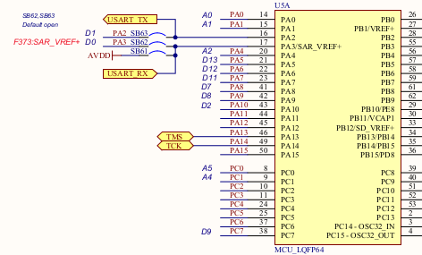
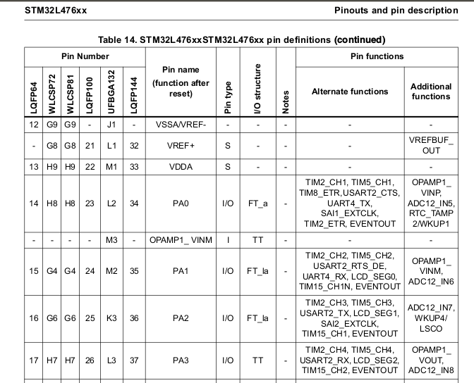
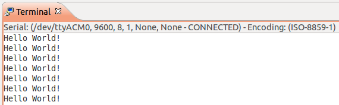
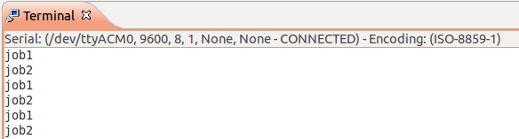
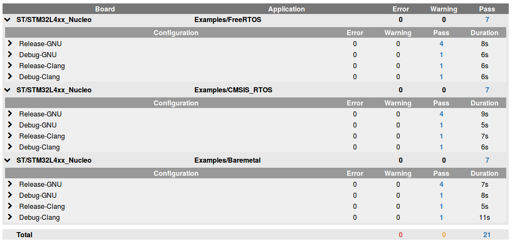

In this document, we will use 'STM32 Nucleo L4' use case to demonstrate how ST's SDK has been added to PolyMCU.

1. Download STM32CubeL4 SDK at <http://www.st.com/web/en/catalog/tools/PF261908>

2. Find which files are the Board specific files and the MCU specific files.

		├── Documentation
		├── Drivers
		│   ├── BSP
		│   │   ├── Adafruit_Shield
		│   │   ├── Components
		│   │   ├── STM32L476G-Discovery
		│   │   ├── STM32L476G_EVAL
		│   │   └── STM32L4xx_Nucleo <-- This our board!
		│   ├── CMSIS     <-- This one is already part of PolyMCU
		│   │   ├── Device
		│   │   │   └── ST     <--- .. but this one is for our MCU
		│   │   │       └── STM32L4xx
		│   │   │           ├── Include
		│   │   │           └── Source
		│   │   │               └── Templates
		│   │   │                   ├── arm
		│   │   │                   ├── gcc
		│   │   │                   └── iar
		│   │   │                       └── linker
		│   │   ├── Documentation
		│   │   ├── DSP_Lib
		│   │   ├── Include
		│   │   ├── Lib
		│   │   └── RTOS
		│   └── STM32L4xx_HAL_Driver <-- another folder for us
		│       ├── Inc
		│       └── Src
		├── _htmresc
		├── Middlewares
		│   ├── ST    <--- These drivers will be needed when USB, UI, TouchSensing will be enabled by users
		│   │   ├── STemWin
		│   │   ├── STM32_TouchSensing_Library
		│   │   ├── STM32_USB_Device_Library
		│   │   └── STM32_USB_Host_Library
		│   └── Third_Party
		│       ├── FatFs
		│       └── FreeRTOS
		├── Projects
		│   ├── STM32L476G-Discovery
		│   │   ├── Applications
		│   │   ├── Demonstrations
		│   │   ├── Examples
		│   │   └── Templates
		│   ├── STM32L476G_EVAL
		│   │   ├── Applications
		│   │   ├── Demonstrations
		│   │   ├── Examples
		│   │   └── Templates
		│   ├── STM32L476RG-Nucleo
		│   │   ├── Applications
		│   │   ├── Demonstrations
		│   │   ├── Examples
		│   │   ├── Examples_LL
		│   │   ├── Examples_MIX
		│   │   └── Templates
		│   └── WIN32
		│       └── STemWin_Simulation
		└── Utilities
				├── CPU
				├── Fonts
				├── Log
				├── Media
				│   ├── Audio
				│   └── Pictures
				└── PC_Software
				    └── STM32CubeUpdater

3. Find the linker script file with `find . -name '*.ld*'`  
We will take the one from `Projects/STM32L476RG-Nucleo/Templates` and copy it into `Device/ST/STM32L4xx/Linker`

4. Integrate the template example `Projects/STM32L476RG-Nucleo/Templates` into `<PolyMCU-root>/Application/ST`. We will use this application provided by ST to make the initial bring-up.

5. Create the first commit to keep track of the original files.  
We do not add `<PolyMCU-root>/Application/ST` as we aim to use `Application/Examples/Baremetal`.

6. Create the CMake files for `Application/ST/Templates`.  
We use `Application.cmake` and `CMakeLists.txt` of the `Examples/Baremetal` application

    * `Application.cmake`: No change as we create a simple application
    * `CMakeLists.txt`:
        - We update Firmware_SRCS with the list of the source files:

            set(Firmware_SRCS Src/main.c)

7. Add CMake support to `Device/ST` by copying `CMakeLists.txt`, `FindARM.cmake` from `Device/ARM`

    * `FindST.cmake` (renamed from `FindARM.cmake`)

        ```
        # Device/ST requires the CMSIS headers
        find_package(CMSIS)

        # MCU specific paths
        set(MCU_ROOT ${CMAKE_CURRENT_LIST_DIR}/STM32L4xx)
        set(MCU_HAL_ROOT ${CMAKE_CURRENT_LIST_DIR}/STM32L4xx_HAL_Driver)
        include_directories(${MCU_ROOT}/Include ${MCU_HAL_ROOT}/Inc)

        # MCU specific definitions
        add_definitions(-DSTM32L476xx)
        set(MCU_EXE_LINKER_FLAGS "-T ${MCU_ROOT}/Linker/STM32L476RGTx_FLASH.ld")

        # 'device_st' is the ST library built from Device/ST
        set(ST_LIBRARIES device_st)
        ```

    * `CMakeLists.txt`

        ```
        # List of the sources that composes the Device/ST library
        set(st_SRCS ${MCU_ROOT}/Source/gcc/startup_stm32l476xx.s
                    ${MCU_ROOT}/Source/system_stm32l4xx.c
                    ${MCU_HAL_ROOT}/Src/stm32l4xx_hal.c
                    ${MCU_HAL_ROOT}/Src/stm32l4xx_hal_cortex.c
                    ${MCU_HAL_ROOT}/Src/stm32l4xx_hal_gpio.c
                    ${MCU_HAL_ROOT}/Src/stm32l4xx_hal_pwr_ex.c
                    ${MCU_HAL_ROOT}/Src/stm32l4xx_hal_rcc.c
                    ${MCU_HAL_ROOT}/Src/stm32l4xx_hal_uart.c)

        # Define 'device_st' as the static library for Device/ST
        add_library(device_st STATIC ${st_SRCS})
        ```

8. Add CMake support to `Board/ST` by copying `Board.cmake`, `CMakeLists.txt`, `FindBoard.cmake` from `Board/ARM`

    * `Board.cmake`:

        ```
        # Tell RTOS we are running at 80Mhz
        set(RTOS_CLOCK 80000000)
        # No UART yet, we only focus on the core MCU support
        set(SUPPORT_DEBUG_UART none)

        # Use the 'ST' modules
        list(APPEND LIST_MODULES Device/ST Board/ST Lib/PolyMCU)

        # STM32L4xx Nucleo uses an ARM Cortex-M4F
        set(CPU "ARM Cortex-M4F")
        ```

    * `FindBoard.cmake`:

        ```
        # Link the Board to Device/ST with `find_package(ST)`
        find_package(ST)

        # Declare the board directory to be used by other modules
        include_directories(${CMAKE_CURRENT_LIST_DIR}/STM32L4xx_Nucleo)

        set(Board_LIBRARIES board_st ${ST_LIBRARIES})
        ```

    * `CMakeLists.txt`

        ```
        cmake_minimum_required(VERSION 2.6)

        # To re-use our own include paths defined by FindBoard.cmake
        find_package(Board)

        set(board_st_SRCS STM32L4xx_Nucleo/stm32l4xx_nucleo.c)

        add_library(board_st STATIC ${board_st_SRCS})
        ```

    * Copy `board.h` from `ARM/ARMCM4` to `ST/STM32L4xx_Nucleo`.  
      Link `board.h` to the ST device by adding `#include "stm32l476xx.h"`

9. Let's see how far we can go with this template application without having made any change:

        mkdir Build && cd Build
        cmake -DAPPLICATION=ST/Templates -DBOARD=ST/STM32L4xx_Nucleo ..
        make

    Results:

        (...)
        [ 85%] Building C object Board/ST/CMakeFiles/board_st.dir/STM32L4xx_Nucleo/stm32l4xx_nucleo.c.o
        In file included from /home/olivier/labapart/polymcu/Board/ST/STM32L4xx_Nucleo/stm32l4xx_nucleo.h:59:0,
                         from /home/olivier/labapart/polymcu/Board/ST/STM32L4xx_Nucleo/stm32l4xx_nucleo.c:43:
        /home/olivier/labapart/polymcu/Device/ST/STM32L4xx_HAL_Driver/Inc/stm32l4xx_hal.h:48:32: fatal error: stm32l4xx_hal_conf.h: No such file or directory
         #include "stm32l4xx_hal_conf.h"

    The file actually exists in `Application/ST/Templates/Inc/stm32l4xx_hal_conf.h`. We prefer to not have to duplicate this file for every application. So we will move it into Device/ST/STM32L4xx_HAL_Driver/Inc.  
    Actually, there is already a file named `stm32l4xx_hal_conf_template.h` there. So, let's copy this one.

10. After solving this issue, next try:

        (...)
        Linking C executable Baremetal_Example.elf
        CMakeFiles/Firmware.dir/Src/main.c.o: In function `main':
        /home/olivier/labapart/polymcu/Application/ST/Templates/Src/main.c:75: undefined reference to `HAL_Init'
        CMakeFiles/Firmware.dir/Src/main.c.o: In function `SystemClock_Config':
        /home/olivier/labapart/polymcu/Application/ST/Templates/Src/main.c:126: undefined reference to `HAL_RCC_OscConfig'
        /home/olivier/labapart/polymcu/Application/ST/Templates/Src/main.c:139: undefined reference to `HAL_RCC_ClockConfig'
        ../../../Lib/PolyMCU/libpolymcu.a(misc.c.o): In function `prvGetRegistersFromStack':
        /home/olivier/labapart/polymcu/Lib/PolyMCU/misc.c:136: undefined reference to `set_led'
        collect2: error: ld returned 1 exit status

    Solve this issue by adding the appropriate `STM32L4xx_HAL_Driver/Src` files to the Device's CMakeLists.txt

    The last issue to solve is `undefined reference to 'set_led'`. For this one, we could create a empty implementation in a new `Board/ST/STM32L4xx_Nucleo/board.c` file.

    Let's try again...

        Linking C executable Baremetal_Example.elf
           text	   data	    bss	    dec	    hex	filename
           9176	     16	   1568	  10760	   2a08	/home/olivier/labapart/polymcu/Build/Application/ST/Templates/Baremetal_Example.elf

    **Success!**

11. Our next challenge is to make `Examples/Baremetal` works without any change to the example.  
Let's see if the application builds by itself:

        rm -Rf * && cmake -DAPPLICATION=Examples/Baremetal -DBOARD=ST/STM32L4xx_Nucleo .. && make

    Results:

        (...)
        Linking C executable Baremetal_Example.elf
        ../../../Lib/PolyMCU/libpolymcu.a(misc.c.o): In function `_sbrk_r':
        /home/olivier/labapart/polymcu/Lib/PolyMCU/misc.c:59: undefined reference to `__HeapBase'
        /home/olivier/labapart/polymcu/Lib/PolyMCU/misc.c:59: undefined reference to `__StackLimit'
       collect2: error: ld returned 1 exit status
        ```

    `_sbrk_r()` - function used for dynamic allocations (eg: `malloc()`) - requires these both symbols.

          ._user_heap_stack :
          {
            . = ALIGN(4);
            PROVIDE ( end = . );
            PROVIDE ( _end = . );
            __HeapBase = .; /* Heap does up */
            . = . + _Min_Heap_Size;
            __StackLimit = .; /* Stack goes down. */
            . = . + _Min_Stack_Size;
            . = ALIGN(4);
            PROVIDE(__stack = .);
          } >RAM

12. Let's understand the software boot flow from the first execution executed on the Cortex-M to the `main()`.

    From `Device/ST/STM32L4xx/Source/gcc/startup_stm32l476xx.s`:

        g_pfnVectors:
	        .word	_estack
        	.word	Reset_Handler
	        .word	NMI_Handler
        	.word	HardFault_Handler
	        .word	MemManage_Handler
        	.word	BusFault_Handler
	        .word	UsageFault_Handler
        	.word	0

        Reset_Handler() {
          // Copy the data segment initializers from flash to SRAM
          // Zero fill the bss segment
          // Call the clock system intitialization function: SystemInit()
          // Call static constructors: __libc_init_array()
          // Call main()
        }

    We replace `__libc_init_array()` and`main()` calls by Newlib's `_start()` call.  
    `_start()` calls platform specific hooks `hardware_init_hook()` and `software_init_hook()`.

13. Implement `hardware_init_hook` with the functions invoked into the Template's main().

        void hardware_init_hook(void) {
          // STM32L4xx HAL library initialization
          HAL_Init();
          // Configure the System clock to have a frequency of 80 MHz
          SystemClock_Config();
        }

    We do not need to implement `software_init_hook()`.

14. Add UART support:

    - Copy the file from `CMSIS/Driver/DriverTemplates/Driver_USART.c` to `Device/ST/Driver/VCom`  
    - And use the ST SDK UART functions from `STM32L4xx_HAL_Driver/Src/stm32l4xx_hal_uart.c`

    Which UART among the three USARTs (two UARTs and one Low-Power UART) is connected for the Virtual Serial communication over USB on STM32 Nucleo L4? Let's have a look to the STM32 Nucleo schematic and the STM32L476RG datasheet.

    
    

    USART2 is the one connected which is used for the Virtual Serial communication.

    Let's try again...

    

    **Success!**

15. Next challenge, enabling an RTOS on the board. We will try CMSIS RTOS (also named RTX).

        rm -Rf * && cmake -DAPPLICATION=Examples/CMSIS_RTOS -DBOARD=ST/STM32L4xx_Nucleo .. && make

    Results:

        Linking C executable CMSIS_RTOS_Example.elf
        ../../../RTOS/RTX/libcmsis_rtos.a(HAL_CM4.s.o): In function `SysTick_Handler':
        /home/olivier/labapart/polymcu/Build/RTOS/RTX/HAL_CM4.S:367: multiple definition of `SysTick_Handler'
        ../../../Device/ST/libdevice_st.a(Driver_USART.c.o):/home/olivier/labapart/polymcu/Device/ST/Driver/VCom/Driver_USART.c:148: first defined here
        collect2: error: ld returned 1 exit status

    Conflict between `SysTick_Handler` defined to increment the tick counter used by the UART driver and the function defined by RTOS/RTX for its scheduler.  
    We will provide different implementation of `HAL_GetTick()` following if we are running baremetal or using CMSIS RTOS.

        #if defined(__CMSIS_RTOS)
        __weak uint32_t HAL_GetTick(void) {
          if (osKernelRunning()) {
            return osKernelSysTick();
          } else {
            return 0;
          }
        }
        #else
        __weak uint32_t HAL_GetTick(void) {
          return uwTick;
        }
        #endif

    Let's try again...

    

    **Success!**

16. To ease our development flow, we want to support `make install` that automatically writes the board with the firmware after it has been built.  
      For the ST Nucleo board, it is an easy task. The firmware only needs to be copied on the board USB mass-storage.

    Because we need the install script to be as flexible as possible, we cannot rely on a hardcoded filename in the script. We will use the information given by `/dev/disk/by-id/usb-*`

        # Get the serial number for the Vendor ID 0x0483
        export USB_SERIAL=`lsusb -v -d 0483: | grep iSerial | awk '{print $3}'`

        # Find the associated USB disk
        export USB_DISK=`ls /dev/disk/by-id/usb-* | grep ${USB_SERIAL}`

        # Retrieve the device node
        export USB_DEV=`readlink -e ${USB_DISK}`

        # Get the USB Media (note USB Media can have spaces in its name)
        export USB_MEDIA=`mount | grep ${USB_DEV} | cut -d ' ' -f 3- | sed 's/ type .*//'`

        echo "Copy $1 to ${USB_MEDIA}"
        cp "$1" ${USB_MEDIA}

    We only need to declare this script in `Board/ST/FindBoard.cmake` with:

        set(Board_INSTALL_SCRIPT ${CMAKE_CURRENT_LIST_DIR}/install_binary_to_board.sh)

    We can now simply type `make install` to build and install the firmware on the board.

17. Last step, let's check the various build configurations: GCC/LLVM, Baremetal/CMSIS RTOS/FreeRTOS with our PolyMCU Test framework

    


The **reality** is it has taken a bit more time than what was initially planned to port STM32 Nucleo L4 board to PolyMCU. The main difficulty was the lack of (free) debugging support on Linux for the board.  
We saw this project `https://github.com/texane/stlink` that could have helped us but the program did not recognized the board on my Linux machine...  
We had to debug with the single LED that the board provides.

Some STM32 Nucleo L4 resources:

- [STM32 Nucleo L476RG](http://www.st.com/web/catalog/tools/FM116/SC959/SS1532/LN1847/PF261636)
- [Schematic](http://www.st.com/st-web-ui/static/active/en/resource/technical/layouts_and_diagrams/schematic_pack/nucleo_64pins_sch.zip)
- [STM32L476RG](http://www.st.com/st-web-ui/static/active/en/resource/technical/document/datasheet/DM00108832.pdf)
